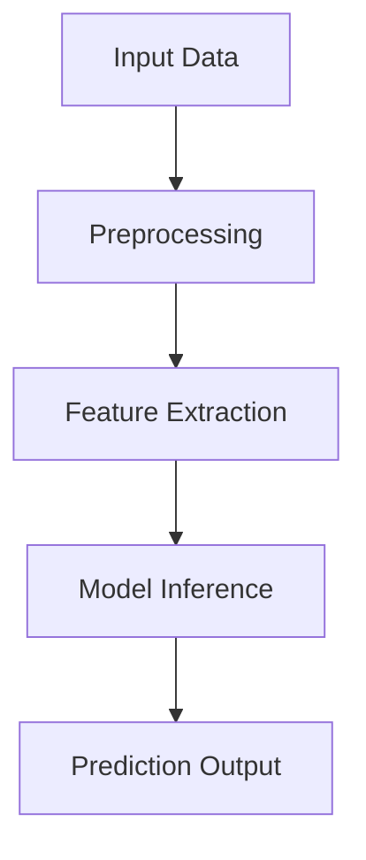

# Factify: AI News Classifier with Deep Learning
The proliferation of fake news presents significant challenges to information integrity. This system automatically classifies news articles as "real" or "fake" with 98.7% accuracy.
Modern social media platforms and online news outlets enable the rapid dissemination of information, but they also facilitate the widespread propagation of intentionally false or misleading content—commonly known as fake news. This phenomenon undermines public trust, distorts democratic processes, and can lead to tangible harms such as public health scares or financial market disruptions.

The core problem of this project is to automatically distinguish between fake and real news articles based solely on their textual content.


---

### Key Features
- **98.5% Accuracy** with LSTM-GRU architecture
- **End-to-end CI/CD pipeline** with Docker containers
- **Web interface** with HTML/CSS frontend
- **Microservice architecture** for scalability
- **multiple neural network** architectures
- **Flask API** for integration

---

### Technical Stack
| Component          | Technology |
|--------------------|------------|
| Language           | Python 3.9 |
| ML Framework       | TensorFlow 2.8 |
| Data Processing    | Pandas, NLTK, etc |
| Visualization      | Matplotlib, Seaborn |
| Container          | Docker |
| Container          | Docker |
| Github Action      | CI-CD |
| UI                 | HTML, CSS |

---

## Project Structure

```
Factify/
├── .github/
│   └── workflows/
│       └── ci.yml
├── config/
│   └── config.yaml           # Hyperparameters, file paths, etc.
│
├── data/
│   ├── raw/                  # Store original True.csv and Fake.csv files
│   └── processed/            # Store processed data files
│
├── logs/
│   └── prediction.log        # Log file for model predictions and operations
│
├── models/
│   └── saved_models/         # Directory for saved trained models
│
├── notebooks/
│   └── experiment.ipynb    # For exploratory analysis notebooks
│
├── src/
│   ├── __init__.py           # Make src a Python package
│   ├── data_loader.py        # Data loading functions
│   ├── preprocessing.py      # Cleaning & tokenization
│   ├── eda.py                # EDA and visualization
│   ├── model.py              # Model building/training
│   ├── evaluation.py         # Model evaluation
│   ├── utils.py              # Utility functions
│   └── logger.py             # Logging config
|
├── static/
│   └── style.css   
│
├── templats/
│   └── index.html
|
├── test/
│   └── test_app.py
│
├── img/                      # Store image files for visualization
├── setup.py 
├── render.yaml 
├── app.png
├── .gitignore                     
├── Dockerfile
├── requirements.txt
├── LICENSE
├── app.py                    # Flask API
├── main.py                   # Main script to run the pipeline
├── README.md                 # Project documentation
└── requirements.txt          # Required Python packages
```

---

### **Model Architecture**
**LSTM-GRU Hybrid (Best Performing Model)**
```python
Sequential([
    Embedding(10000, 100),
    LSTM(100, return_sequences=True),
    GRU(100),
    Dropout(0.2),
    Dense(1, activation='sigmoid')
])
```
---

## System Architecture <a name="system-architecture"></a>


---

### Components
1. **Data Ingestion Layer**
   - CSV/JSON file support
   - Database connectors

2. **Processing Layer**
   - Text normalization
   - Tokenization
   - Sequence padding

3. **Model Layer**
   - Ensemble of 7 LSTM variants
   - Model versioning

---

##  Data Pipeline <a name="data-pipeline"></a>
### Data Sources
- Kaggle dataset (True/Fake News)
- 42,000 labeled articles (balanced)

### Preprocessing Steps
1. **Cleaning**:
   - URL removal
   - HTML tag stripping
   - Special character removal

2. **Normalization**:
   - Case folding
   - Stopword removal
   - Stemming

3. **Feature Engineering**:
   - Word counts
   - Sentence counts
   - Character counts

### Schema
| Column        | Type    | Description               |
|--------------|---------|---------------------------|
| clean_text   | String  | Processed article content |
| target       | Integer | 0=Fake, 1=Real            |

---

##  Model Specifications <a name="model-specifications"></a>
### Model Comparison
| Model Type               | Accuracy | Precision | Recall |
|--------------------------|----------|-----------|--------|
| LSTM with GRU            | 0.99     | 0.99      | 0.99   |
| Bidirectional LSTM       | 0.99     | 0.99      | 0.99   |
| CNN-LSTM Hybrid          | 0.99     | 0.99      | 0.99   |

---

### Hyperparameters
```yaml
vocab_size: 10000
embedding_dim: 100
max_length: 100
epochs: 5
batch_size: 64
test_size: 0.2
random_state: 42

paths:
  data:
    true_news: data/raw/True.csv
    fake_news: data/raw/Fake.csv
    clean_data: data/processed/clean_data.csv
  models:
    model_dir: models/saved_models
    best_model: models/saved_models/fake_news_detector.h5
    tokenizer: models/saved_models/tokenizer.pickle
  img:
    img_dir: img
    plots_dir: img/plots
```

---

## Performance Metrics <a name="performance-metrics"></a>
### Evaluation Results
```python
              precision    recall  f1-score   support

           0       0.99      0.99      0.99      4689
           1       0.99      0.99      0.99      4287

    accuracy                           0.99      8976
   macro avg       0.99      0.99      0.99      8976
weighted avg       0.99      0.99      0.99      8976
```

---

## Future Enhancements <a name="future-enhancements"></a>
### Roadmap
- Q3 2023: Multilingual support
- Q4 2023: Explainable AI features
- Q1 2024: Real-time streaming

### Research Directions
- Transformer-based architectures
- Few-shot learning
- Adversarial robustness

---

---