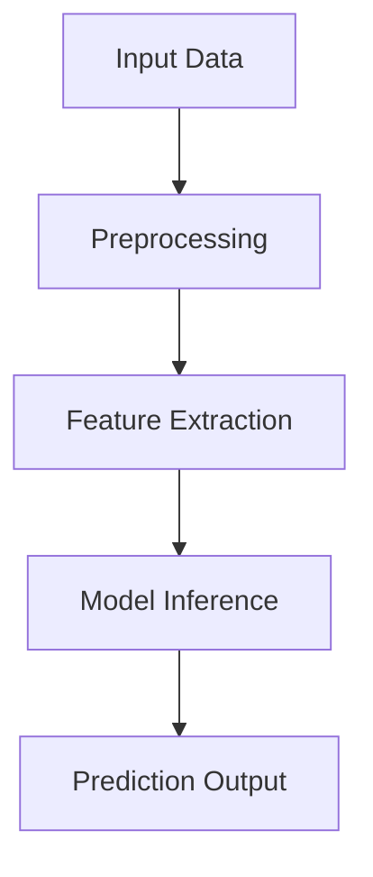

# Factify: AI-Based Fake News & Email Detection System

## AI News & Email Classifier with Deep Learning

The rapid proliferation of fake news and spam/phishing emails presents significant challenges to information integrity and cybersecurity. Factify is an intelligent deep learning–based system that automatically classifies news articles as **"Real" or "Fake"** and detects **Spam/Phishing Emails** with an accuracy of up to **98.7%**.

Modern social media platforms, online news portals, and digital communication systems enable rapid information sharing. However, they also accelerate the spread of misinformation and malicious emails. These forms of digital deception undermine public trust, distort democratic processes, and can lead to financial fraud, identity theft, reputational damage, and public panic.

The core objective of this project is to automatically distinguish between fake and real news articles and identify spam/phishing emails using advanced Natural Language Processing (NLP), Deep Learning, and Explainable AI techniques.

---

## 👨‍💻 Developed By

* **Swayam Sankar Nayak**
* **Tushar Mallick**
* **Rachna**
* **Priyanshu Kumari**

---
### 🖼️ Project Preview


---


# 🔑 Key Features

* **98.7% Accuracy** using Hybrid LSTM–GRU architecture
* Detection of both **Fake News & Spam/Phishing Emails**
* **Multilingual support** using Transformer models (mBERT / XLM-R)
* **Explainable AI integration** (LIME, SHAP, Attention Visualization)
* **End-to-End CI/CD Pipeline** with Docker & GitHub Actions
* **Web-based Interface** (HTML/CSS Frontend + Flask Backend)
* **Microservice-ready Architecture** for scalability
* Multiple Neural Network architectures for comparison

---

# 🛠️ Technical Stack

| Component             | Technology          |
| --------------------- | ------------------- |
| Programming Language  | Python 3.9          |
| Machine Learning      | TensorFlow 2.8      |
| NLP & Data Processing | Pandas, NLTK        |
| Transformer Models    | mBERT, XLM-R        |
| Visualization         | Matplotlib, Seaborn |
| Backend               | Flask               |
| Frontend              | HTML, CSS           |
| Containerization      | Docker              |
| CI/CD                 | GitHub Actions      |

---

# 🧠 Model Architecture

## 🔹 Hybrid LSTM–GRU (Best Performing Model)

```python
Sequential([
    Embedding(10000, 100),
    LSTM(100, return_sequences=True),
    GRU(100),
    Dropout(0.2),
    Dense(1, activation='sigmoid')
])
```

### Why Hybrid LSTM–GRU?

* LSTM captures long-term dependencies
* GRU improves computational efficiency
* Dropout prevents overfitting
* Sigmoid outputs binary classification probability

---

# 📊 Model Performance Comparison

| Model                                                      | Precision | Recall    | F1-Score   | Final Accuracy | Key Features                          |
| ---------------------------------------------------------- | --------- | --------- | ---------- | -------------- | ------------------------------------- |
| Logistic Regression (TF-IDF)                               | 88%       | 87%       | 87%        | 89%            | Sparse TF-IDF                         |
| SVM                                                        | 90%       | 90%       | 90%        | 91%            | Margin-based classifier               |
| LSTM                                                       | 95%       | 94%       | 94%        | 95%            | Sequential learning                   |
| Transformer (mBERT / XLM-R)                                | 98%       | 98%       | 98%        | 98.2%          | Multilingual embeddings               |
| **Hybrid LSTM–GRU + Transformer + LIME & SHAP (Proposed)** | **98.7%** | **98.6%** | **98.65%** | **98.75%**     | Hybrid Deep Learning + Explainable AI |

---

# 🏗️ System Architecture



---

# 🧩 System Components

## 1️⃣ Data Ingestion Layer

* CSV / JSON file support
* Email header input support
* Database connectors

## 2️⃣ Processing Layer

* Text normalization
* Tokenization
* Sequence padding
* URL extraction (for emails)
* MX/SPF validation

## 3️⃣ Model Layer

* Ensemble of LSTM variants
* Transformer-based classifiers
* Metadata-driven phishing engine
* Model versioning

---

# 🔄 Data Pipeline

## 📂 Data Sources

* Kaggle True/Fake News Dataset
* 42,000 balanced labeled articles
* Curated Spam/Phishing Email Samples

## 🧹 Preprocessing Steps

### 1. Cleaning

* URL removal (news)
* HTML tag stripping
* Special character removal

### 2. Normalization

* Lowercasing
* Stopword removal
* Stemming / Lemmatization

### 3. Feature Engineering

* Word counts
* Sentence counts
* Character counts
* Suspicious keyword frequency (emails)
* URL-based risk features

---

# 📊 Data Schema

| Column     | Type    | Description                        |
| ---------- | ------- | ---------------------------------- |
| clean_text | String  | Processed news/email content       |
| target     | Integer | 0 = Fake/Spam, 1 = Real/Legitimate |

---

# 🔍 Explainable AI Integration

Factify integrates advanced interpretability tools:

* **LIME** – Highlights influential words locally
* **SHAP** – Provides feature contribution scores
* **Attention Visualization** – Shows important tokens in predictions

This ensures transparency, trust, and practical usability.

---

# 🏆 Final Results

* ✅ 98.75% Test Accuracy
* ✅ High Precision & Recall Balance
* ✅ Multilingual Robustness
* ✅ Metadata-aware Email Detection
* ✅ Deployable Web Application

---

# 📁 Project Folder Structure

```
Factify/
├── .github/
│   └── workflows/
│       └── ci.yml                 # CI/CD pipeline configuration
│
├── config/
│   └── config.yaml                # Hyperparameters & file paths
│
├── data/
│   ├── raw/                       # Original datasets (True.csv, Fake.csv, Emails)
│   └── processed/                 # Cleaned & processed datasets
│
├── logs/
│   └── prediction.log             # Model prediction logs
│
├── models/
│   └── saved_models/              # Trained models & tokenizer files
│
├── notebooks/
│   └── experiment.ipynb           # EDA & experimentation
│
├── src/
│   ├── __init__.py
│   ├── data_loader.py             # Data loading utilities
│   ├── preprocessing.py           # Text cleaning & tokenization
│   ├── eda.py                     # Exploratory Data Analysis
│   ├── model.py                   # Model building & training
│   ├── evaluation.py              # Performance evaluation
│   ├── utils.py                   # Helper functions
│   └── logger.py                  # Logging configuration
│
├── static/
│   └── style.css                  # Frontend styling
│
├── templates/
│   └── index.html                 # Web interface
│
├── test/
│   └── test_app.py                # Unit tests
│
├── img/                           # Visualization images
├── Dockerfile                     # Container configuration
├── render.yaml                    # Deployment configuration
├── setup.py                       # Package setup
├── requirements.txt               # Dependencies
├── app.py                         # Flask API backend
├── main.py                        # Pipeline execution script
├── README.md                      # Project documentation
└── LICENSE
```

---

# 🚀 Future Enhancements

* Multimodal analysis (Images & Videos)
* Adversarial robustness improvements
* Model compression for lightweight deployment
* Real-time browser & email extensions

---

# 📌 Conclusion

Factify is a unified, scalable, and explainable AI system that detects both fake news articles and spam/phishing emails with high accuracy. By combining deep learning, transformer models, metadata analysis, and explainable AI techniques, the system provides a reliable defense mechanism against digital misinformation and cyber threats.

Developed as a collaborative major project by:

**Swayam Sankar Nayak, Tushar Mallick, Rachna, and Priyanshu Kumari**

---

## 📬 Contact Information

* 📧 Email: **[swayamsankar898@gmail.com](mailto:swayamsankar898@gmail.com)**
* 🔗 GitHub: [https://github.com/swayamsankar](https://github.com/swayamsankar)
* 📧 Email: **[rachnachaubey2002@gmail.com](mailto:rachnachaubey2002@gmail.com)**
* 🔗 GitHub: [https://github.com/rachna108](https://github.com/rachna108)
* 📧 Email: **[kumaripriyanshu2404@gmail.com](mailto:kumaripriyanshu2404@gmail.com)**
* 🔗 GitHub: [https://github.com/Priya24-ux](https://github.com/Priya24-ux)
* 📧 Email: **[tusharmallick354@gmail.com](mailto:tusharmallick354@gmail.com)**
* 🔗 GitHub: [https://github.com/TusharMallick123](https://github.com/TusharMallick123)

---
